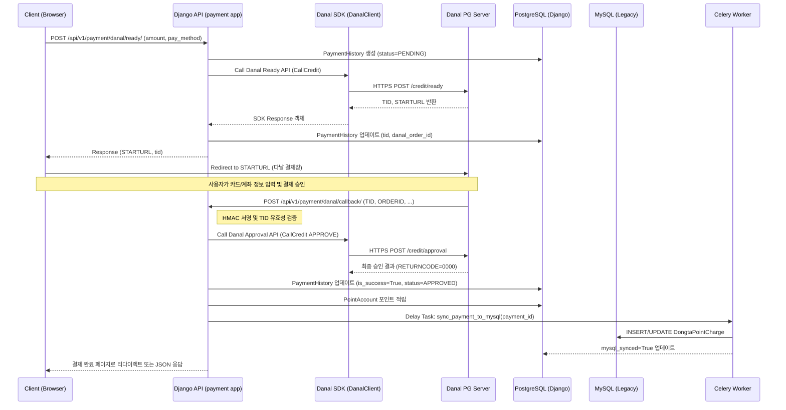

# 다날 결제 통합 Design Document

> **Summary**: PHP 레거시 다날 결제를 Django REST API로 완전 전환하고, 결제 결과를 MySQL/PostgreSQL 양쪽에 이중 기록하는 상세 기술 설계
>
> **Project**: dongta.com
> **Version**: 1.0.0
> **Author**: Team
> **Date**: 2026-03-07
> **Status**: Draft
> **Planning Doc**: [다날_결제_통합.plan.md](../01-plan/features/다날_결제_통합.plan.md)

---

## 1. Design Goals

1. **보안성**: SQL Injection이 존재하는 PHP 레거시 코드를 제거하고, HMAC 서명 검증이 포함된 안전한 Django 코드로 대체
2. **무중단 운영**: 하이브리드 운영 기간 동안 결제 결과를 기존 MySQL에도 실시간 기록하여 레거시 기능(포인트 소진 등) 유지
3. **확장성**: 향후 타 PG사(KCP, Toss 등) 추가 시 유연하게 대응할 수 있는 인터페이스 설계
4. **사용자 경험**: 다날 결제창 호출 시 지연 시간을 최소화하고 명확한 에러 메시지 제공

---

## 2. Architecture

### 2.1 결제 시퀀스 (Danal CPAY)



---

## 3. Data Model Extension

### 3.1 PaymentHistory (apps/payment/models.py)

기존 모델을 다음과 같이 확장합니다.

| Field | Type | Description |
|-------|------|-------------|
| **tid** | CharField(100) | 다날 거래 식별자 (TID), Unique, Index |
| **status** | CharField(20) | PENDING, APPROVED, REJECTED, CANCELLED |
| **danal_response** | JSONField | 다날 서버로부터 받은 원본 응답 보존 |
| **mysql_synced** | BooleanField | MySQL 레거시 DB 동기화 완료 여부 |
| **error_code** | CharField(10) | 결제 실패 시 리턴된 코드 |
| **error_message** | TextField | 결제 실패 시 리턴된 메시지 |

---

## 4. Danal SDK Python Wrapper (DanalClient)

### 4.1 핵심 클래스 구조

```python
# apps/payment/danal/client.py

class DanalClient:
    """다날 CPAY SDK 클라이언트"""
    
    def __init__(self, cpid, cppwd, is_test=True):
        self.cpid = cpid
        self.cppwd = cppwd
        self.base_url = "https://tx-creditcard.danal.co.kr/credit" # 실서버 기준
        
    def ready(self, order_id, amount, item_name, user_id, **kwargs):
        """결제 준비 (CallCredit)"""
        params = {
            "TXTYPE": "AUTH",
            "SERVICETYPE": "DANALCARD", # 또는 DANALBANK
            "CPID": self.cpid,
            "CPPWD": self.cppwd,
            "ORDERID": order_id,
            "AMOUNT": amount,
            "CURRENCY": "410",
            "ITEMNAME": item_name,
            "USERID": user_id,
            "RETURNURL": "...",
            "CANCELURL": "...",
        }
        return self._post("/ready", params)

    def approve(self, tid):
        """결제 승인 (Approve)"""
        params = {
            "TXTYPE": "APPROVE",
            "TID": tid,
            "CPID": self.cpid,
            "CPPWD": self.cppwd,
        }
        return self._post("/approval", params)

    def cancel(self, tid, amount, reason):
        """결제 취소 (Cancel)"""
        params = {
            "TXTYPE": "CANCEL",
            "TID": tid,
            "CPID": self.cpid,
            "CPPWD": self.cppwd,
            "AMOUNT": amount,
            "CANCELREASON": reason,
        }
        return self._post("/cancel", params)

    def _post(self, path, params):
        # requests를 이용한 HTTPS 통신 및 EUC-KR 인코딩 처리
        pass
```

---

## 5. Dual Write Strategy (MySQL 동기화)

### 5.1 Celery Task 구현

결제 성공 시 PostgreSQL에 먼저 기록한 후, 비동기로 MySQL에 기록합니다.

```python
# apps/payment/tasks.py

@shared_task(bind=True, max_retries=5)
def sync_payment_to_mysql(self, payment_id):
    """결제 내역을 레거시 MySQL에 이중 기록"""
    from apps.payment.models import PaymentHistory
    
    try:
        payment = PaymentHistory.objects.get(id=payment_id)
        
        # MySQL 레거시 테이블(DongtaPointCharge)에 기록
        with connections['legacy'].cursor() as cursor:
            cursor.execute("""
                INSERT INTO DongtaPointCharge 
                (nMembIdx, nChargePrice, nChargeDP, vcPayMethod, bSuccess, 
                 vcPayResultCode, vcPayResultMsg, sOrderId, dRegDate)
                VALUES (%s, %s, %s, %s, %s, %s, %s, %s, NOW())
            """, [
                payment.member_id, payment.amount, payment.point_amount,
                payment.pay_method, 1 if payment.is_success else 0,
                payment.result_code, payment.result_message, payment.danal_order_id
            ])
            
        payment.mysql_synced = True
        payment.save(update_fields=['mysql_synced'])
        
    except Exception as exc:
        # 지수 백오프로 재시도
        raise self.retry(exc=exc, countdown=60 * (2 ** self.request.retries))
```

---

## 6. Security Design

### 6.1 Callback Verification

다날에서 전송되는 콜백 데이터가 위변조되지 않았는지 확인합니다.

1. **IP 화이트리스트**: `request.META['REMOTE_ADDR']`가 다날 서버 IP 범위에 있는지 확인
2. **HMAC 서명**: 다날 서버 응답에 포함된 서명값이 전송된 파라미터와 일치하는지 검증 (필요 시)
3. **상태 기반 검증**: 이미 `APPROVED`인 `TID`에 대한 중복 콜백 처리 방어

---

## 7. Error Handling

| Error Code | HTTP Status | Description | User Action |
|------------|-------------|-------------|-------------|
| `PAY_002` | 400 | 다날 서버 통신 오류 | 잠시 후 다시 시도해 주세요. |
| `PAY_003` | 400 | 유효하지 않은 결제 요청 | 결제 금액 또는 수단을 확인해 주세요. |
| `PAY_004` | 400 | 결제 승인 거절 (한도 초과 등) | 카드사 문의 또는 다른 카드를 사용해 주세요. |
| `PAY_005` | 403 | 콜백 검증 실패 (보안 위험) | 관리자에게 문의해 주세요. |

---

## 8. Implementation Order

### Step 1: 모델 및 요구사항 준비
1. `PaymentHistory` 모델 필드 추가 및 Migration
2. `requirements/base.txt`에 `requests`, `pycryptodome` 추가

### Step 2: Danal SDK 구현
1. `apps/payment/danal/client.py` 및 `config.py` 구현
2. `.env`에 다날 가맹점 정보(CPID, CPPWD) 추가

### Step 3: API View 구현
1. `DanalReadyView` 실제 연동 (STARTURL 반환)
2. `DanalCallbackView` 구현 (승인 처리 및 포인트 적립)
3. `DanalCancelView` 구현 (취소 처리)

### Step 4: 비동기 동기화 및 검증
1. `sync_payment_to_mysql` Celery Task 구현
2. 통합 테스트 (테스트 결제창 호출 및 MySQL 기록 확인)

---

## 9. Test Plan

### 9.1 Unit Test
- `DanalClient`가 파라미터를 정확히 인코딩하는지 테스트
- `PaymentHistory` 상태 전이(PENDING -> APPROVED) 테스트

### 9.2 Integration Test (Danal Sandbox)
- 실시간 결제창 호출 및 `STARTURL` 유효성 확인
- 콜백 수신 시 가짜 TID에 대한 거절 처리 확인
- 결제 성공 후 MySQL 데이터 생성 여부 쿼리 검증

---

## Version History

| Version | Date | Changes | Author |
|---------|------|---------|--------|
| 0.1 | 2026-03-07 | 초기 설계안 작성 | Gemini CLI |
